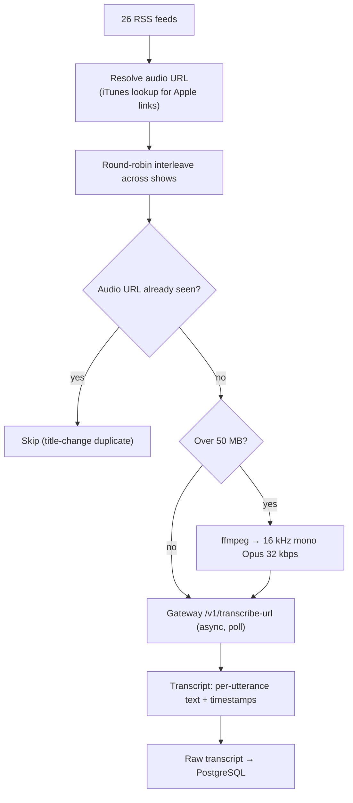
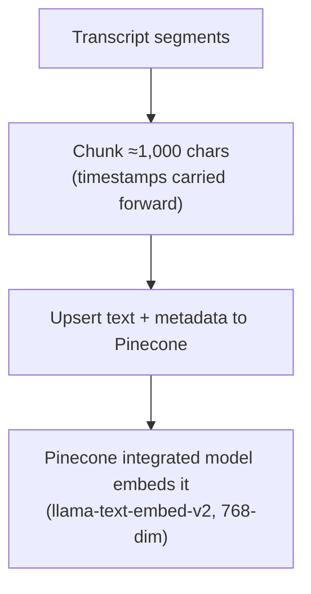
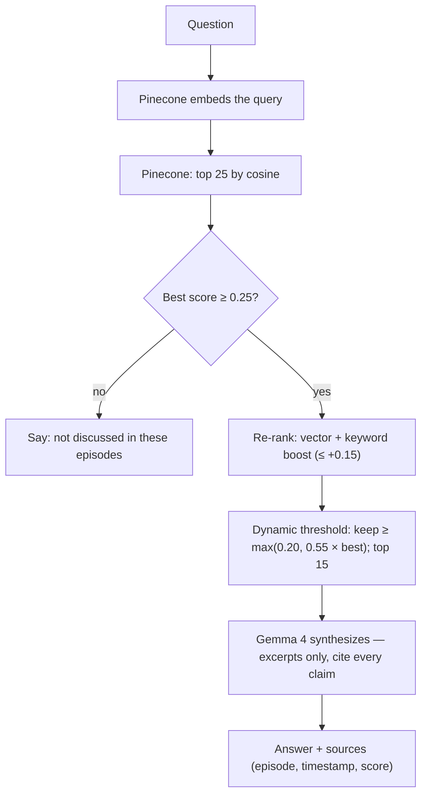
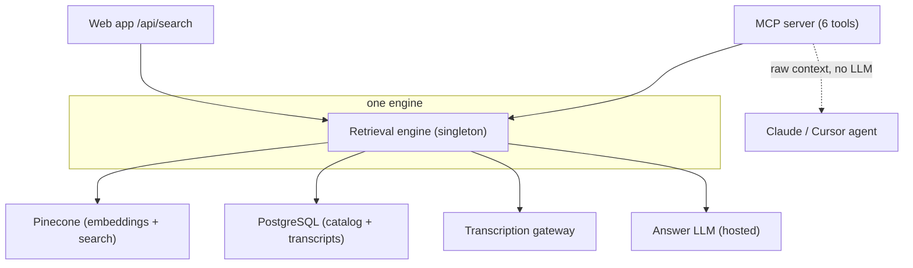

# Architecture

Podcast Search is one linear pipeline in three acts: **Ingest & transcribe** (turn
audio into a timestamped transcript), **Chunk, embed & store** (turn the transcript
into searchable meaning), and **Retrieve & answer** (turn a question into a cited
answer). The guiding constraint is editorial: an answer you can't verify is worthless,
so every claim must trace back to a specific excerpt. The design choice that follows is
to treat the LLM as a *synthesizer, not a knowledge base* — and to carry timestamps all
the way through so the answer can render as a receipt.

---

## 1. Ingest & transcribe

RSS feeds are read, each episode's real audio URL is resolved (including via the iTunes
lookup API for Apple Podcasts links), and episodes are interleaved round-robin across
shows so no single feed dominates. Audio goes to a self-hosted, OpenAI-compatible
inference gateway for speech-to-text (Parakeet), which returns per-utterance text with
timestamps. Oversize episodes are compressed with ffmpeg first to fit the gateway's
50 MB cap.

| Step | Decision | Method |
|------|----------|--------|
| Resolve | Where is the actual audio? | RSS enclosure; iTunes lookup API for Apple Podcasts links |
| Order | Which episode next? | Round-robin (`zip_longest`) across shows, so breadth beats depth |
| Dedup | Have we seen this audio? | Track seen audio URLs — catches "phantom" duplicates from title changes |
| Resilience | A show keeps failing? | Skip it after 3 consecutive failures; log every failure with a reason |
| Transcribe | Audio → text | Parakeet on the gateway, async submit-and-poll; oversize audio compressed first |

---

## 2. Chunk, embed & store

The transcript is grouped into ~1,000-character passages — big enough to hold a thought,
small enough to pinpoint — each carrying its timestamps forward. Each passage is upserted
to **Pinecone as a text record**; Pinecone's integrated embedding model
(`llama-text-embed-v2`, 768-dim) vectorizes the text on the way in, so the app never
computes embeddings itself.

Record IDs are a deterministic string `<episode_id>_c<NNNN>`, so re-indexing an episode
overwrites its chunks cleanly rather than duplicating them. See [SCHEMA.md](SCHEMA.md)
for the record shape.

---

## 3. Retrieve & answer

The question is embedded and matched against Pinecone. Pure vector search understands
meaning but underweights exact tokens, so a lightweight keyword boost is layered on top,
and a dynamic threshold trims to the keepers. The surviving excerpts go to the LLM under
a strict grounding prompt.

### Three decisions worth calling out

**1. Grounded, not generative.** The system prompt's first rule: *every claim must be
traceable to a specific excerpt.* If the excerpts don't contain the answer, the model
says so rather than inventing one. Because the retrieval layer carries timestamps
through, each source links back to the exact moment — the answer is a receipt, and that
verifiability is the product.

**2. Hybrid retrieval — cheap, fixes a real failure mode.** Pure vectors get the *vibe*
but bury exact names ("RevenueCat" can lose to a passage merely *about* pricing). After
the vector pull, a keyword-overlap boost (capped at `+0.15`, after stop-word removal)
lifts proper nouns and exact phrases back up; a dynamic threshold (within 55% of the
best combined score, floor `0.20`) trims the tail. Most of a re-ranker's win for almost
none of the cost — a deliberate 80/20 call.

**3. One engine, two surfaces.** The same retrieval engine backs both the web app and an
MCP server (6 tools) that AI agents call directly. The MCP server returns *raw context
only* — it never calls an LLM; the calling agent reasons on its own. A process-wide
singleton shares caches and clients between the surfaces, so the capability is built
once and exposed twice.

---

## The right tool for each stage

Each stage runs where it's cheapest and most reliable, wired together by config:
**transcription** stays on a self-hosted Parakeet gateway (the heavy, high-volume audio
work — no per-minute API bill); **embeddings + vector search** are handed to
**Pinecone's integrated embedding** (it embeds the chunk on upsert and the query on
search, so there's no embedding service to run, and search never competes with
indexing); and **answer generation** runs on a fast hosted LLM. Every stage is a couple
of environment variables. The models are commodities; the retrieval quality is the moat.

## Engineering for the real world

- **Caching** — the catalog is read constantly and changes rarely, so it's served from
  an in-memory cache backed by PostgreSQL on a 2-minute TTL (stale-while-revalidate, so
  reads never block on the database).
- **Resilience** — auth + rate limiting (`X-API-Key`, 60/min) on the sensitive
  endpoints; skip a show after 3 consecutive failures; audio-URL dedup; every failure
  logged with a reason and streamed to the UI.
- **Deployment** — Docker on a small always-on VPS, with the heavy lifting behind the
  gateway. See [DEPLOY.md](DEPLOY.md).

## Summary

PostgreSQL for the facts, Pinecone for embeddings + semantic similarity, a self-hosted
gateway for transcription, a hosted LLM for answers, FastAPI + a React SPA on top, and
the same engine exposed to both people (web) and agents (MCP). See [SCHEMA.md](SCHEMA.md)
for the data model and [docs/MCP_GUIDE.md](docs/MCP_GUIDE.md) for the agent surface.
